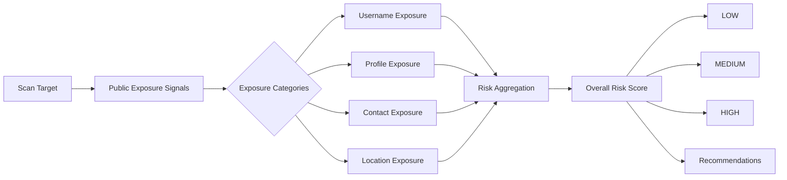
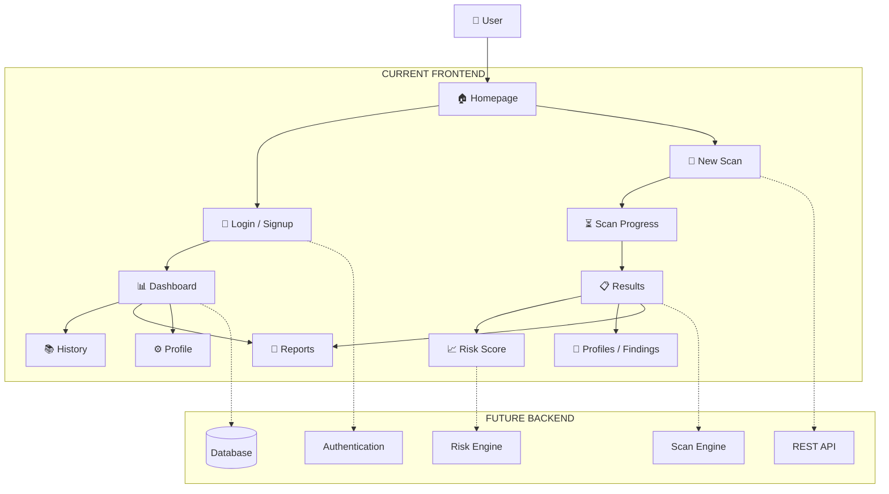

# 🛡️ TraceMySelf

<p align="center">
  
  
  
  
</p>

<p align="center">
  <strong>Know what the internet knows about you.</strong><br/>
  Discover publicly visible digital exposure, understand your risk, and turn findings into practical privacy actions.
</p>

<p align="center">
  <a href="https://ayushkumargupta0551-blip.github.io/Trace_My_Self/"><strong>🚀 Live Demo</strong></a>
  &nbsp; • &nbsp;
  <a href="https://github.com/ayushkumargupta0551-blip/Trace_My_Self"><strong>💻 GitHub Repository</strong></a>
</p>

---

## 🌐 What is TraceMySelf?

**TraceMySelf** is a privacy-focused digital footprint awareness platform designed to help users understand how much publicly accessible information can be associated with their online identity.

The experience takes a user from:

**Search → Discovery → Analysis → Risk Visualization → Reporting → History**

Instead of manually checking multiple places on the internet, TraceMySelf presents digital exposure in a structured and understandable way.

The application supports scan-oriented workflows for:

* 🔎 Username
* 📧 Email
* 🌐 Website
* 👤 Name

The interface also includes dashboards, findings, source views, risk analysis, recommendations, saved scan history, reports, profiles, login, and signup experiences.

> 🔐 **Privacy-first principle:** TraceMySelf focuses on publicly available information. Never enter passwords, OTPs, banking details, private messages, authentication codes, or other sensitive credentials into a scan.

---

# 🚀 Why TraceMySelf?

Your digital identity is rarely stored in one place.

A username may appear on multiple platforms.

An email address may be referenced by public pages.

A profile may reveal information that connects to another account.

Individually, each piece might seem insignificant.

Together, they can create a much clearer picture of your online presence.

**TraceMySelf is designed to make that exposure visible.**

```text
                       DIGITAL IDENTITY
                              │
              ┌───────────────┼────────────────┐
              │               │                │
          Username          Email          Website / Name
              │               │                │
              └───────────────┼────────────────┘
                              ▼
                    PUBLIC EXPOSURE CHECK
                              │
                              ▼
                      FINDINGS & SOURCES
                              │
                              ▼
                         RISK ANALYSIS
                              │
              ┌───────────────┼────────────────┐
              │               │                │
           Severity       Categories     Recommendations
              │               │                │
              └───────────────┼────────────────┘
                              ▼
                 REPORT + HISTORY + ACTION
```

---

# ✨ Key Features

| Feature                  | Description                                                                          |
| ------------------------ | ------------------------------------------------------------------------------------ |
| 🔎 **Username Search**   | Explore where a username may appear across supported public platforms.               |
| 📧 **Email Exposure**    | Review exposure signals associated with an email identifier.                         |
| 🌐 **Website Scan**      | Support website-oriented scanning within the product workflow.                       |
| 👤 **Name Search**       | Support identity-oriented public-information discovery.                              |
| 📊 **Risk Analysis**     | Present exposure through an understandable risk score.                               |
| 🎯 **Risk Categories**   | Break exposure into areas such as username, profile, contact, and location exposure. |
| 🧾 **Detailed Results**  | Display findings, sources, severity, and recommended actions.                        |
| 📚 **Scan History**      | Search and filter previous scans.                                                    |
| 📑 **Reports**           | Review saved analyses and report-oriented actions.                                   |
| 👤 **Profiles**          | Navigate profile and identity-oriented result views.                                 |
| 🔐 **Authentication UI** | Dedicated login and signup pages.                                                    |
| 📱 **Responsive Design** | Responsive layouts across desktop, tablet, and mobile sizes.                         |
| 🧭 **Dashboard**         | Centralized overview of activity, statistics, risk, and quick actions.               |

The current repository contains dedicated pages for the homepage, login, signup, dashboard, scanning, scan progress, results, risk score, profiles, history, reports, and user profile.

---

# 🧩 Product Workflow

## 1️⃣ Enter

Choose the type of scan and provide a target such as:

```text
Username
Email
Website
Name
```

The scan interface is built around these target types.

## 2️⃣ Scan

The application moves through a dedicated scan/progress experience.

```text
Target
  ↓
Validation
  ↓
Scanning
  ↓
Collect Findings
  ↓
Prepare Analysis
```

## 3️⃣ Explore Results

The results interface organizes information into:

* Source cards
* Findings
* Severity indicators
* Recommendations

## 4️⃣ Understand Risk

The risk analysis page visualizes an overall score and category-level exposure.

## 5️⃣ Save & Review

Users can revisit previous activity through:

```text
History
   ↓
Reports
   ↓
Detailed Results
```

The history and reports experiences are already represented in the frontend.

---

# 🧠 Risk Analysis Concept

The current UI demonstrates the concept of combining multiple exposure areas into an overall risk indicator.



The current risk-score interface includes an overall score and category indicators for username, profile, contact, and location exposure.

> **Important:** The current frontend demonstrates the risk-analysis experience and visualization. A production implementation should connect those values to a real backend scoring engine.

---

# 🏗️ Application Architecture

The project currently has a multi-page frontend and a GitHub Actions deployment workflow.



---

# 🗺️ Complete Page Map

```text
TraceMySelf
│
├── 🏠 Home
│   ├── Hero
│   ├── How It Works
│   ├── Features
│   ├── Why Digital Footprint?
│   ├── Discovery Section
│   └── FAQ
│
├── 🔐 Authentication
│   ├── Login
│   └── Signup
│
└── 🛡️ Application
    ├── Dashboard
    ├── New Scan
    ├── Scan Progress
    ├── Results
    ├── Risk Score
    ├── Profiles
    ├── History
    ├── Reports
    └── Profile
```

---

# 🎨 UI / Design Philosophy

TraceMySelf follows a dark, modern, security-oriented interface.

### Design language

```text
Dark Surfaces
      +
Blue / Purple Accents
      +
Rounded Cards
      +
Risk Badges
      +
Progress Indicators
      +
Responsive Layout
      ↓
Modern Security Dashboard
```

The current pages use dark surfaces, blue/purple accents, cards, badges, progress bars, source cards, responsive grids, and mobile breakpoints.

---

# 📊 Example Risk Visualization

The current demo includes a visual risk meter and category indicators.

For example, the UI demonstrates:

```text
                 OVERALL RISK
              ╭──────────────╮
           ╭──┤      72      ├──╮
          │   │     /100     │   │
          │   │     HIGH     │   │
           ╰──┤              ├──╯
              ╰──────────────╯
```

Category example:

```text
Username Exposure   █████████░ 90%
Profile Exposure    ███████░░░ 70%
Contact Exposure    ██████░░░░ 60%
Location Exposure   ████░░░░░░ 40%
```

These values are representative UI/demo values from the current implementation and should not be interpreted as a real person's exposure measurement.

---

# 🔍 What TraceMySelf Helps You Discover

## 👤 Username Footprint

Understand where a username may appear across online platforms.

## 📧 Public Email Exposure

Review publicly visible exposure signals associated with an email identifier.

## 🗄️ Data-Broker Exposure

Understand how public listings and identity references may exist across the wider web ecosystem.

## 🔗 Correlation Risk

Separate pieces of public information can become significantly more revealing when they are connected.

## 🧭 Actionable Recommendations

The goal is not only to show information, but also to help users understand **what deserves attention first**.

These themes are reflected in the homepage's discovery-focused messaging.

---

# 📁 Repository Structure

```text
Trace_My_Self/
│
├── .github/
│   └── workflows/
│       └── deploy.yml
│
├── .vscode/
│   └── settings.json
│
└── frontend/
    ├── index.html
    ├── login.html
    ├── signup.html
    ├── dashboard.html
    ├── scan.html
    ├── scan-progress.html
    ├── results.html
    ├── risk-score.html
    ├── profiles.html
    ├── history.html
    ├── reports.html
    ├── profile.html
    ├── script.js
    ├── style.css
    └── README.md
```

The repository tree confirms the multi-page frontend and deployment workflow.

---

# 🛠️ Technology Stack

| Technology         | Purpose                                    |
| ------------------ | ------------------------------------------ |
| **HTML5**          | Application structure and page markup      |
| **CSS3**           | Responsive layouts and UI styling          |
| **JavaScript**     | Client-side interactions and demo behavior |
| **Git**            | Version control                            |
| **GitHub**         | Source control and collaboration           |
| **GitHub Pages**   | Live frontend deployment                   |
| **GitHub Actions** | Deployment workflow                        |

> The current implementation is primarily a frontend/demo experience. The project's existing frontend documentation notes that a production implementation would connect backend services for scan discovery, authentication, PDF generation, database persistence, and real risk calculation.

---

# ▶️ Run Locally

## Clone the Repository

```bash
git clone https://github.com/ayushkumargupta0551-blip/Trace_My_Self.git
```

## Open the Frontend

```bash
cd Trace_My_Self/frontend
```

## Run with VS Code Live Server

Open:

```text
frontend/index.html
```

Then launch it using **Live Server**.

The original frontend documentation recommends this method.

---

## Alternative: Python Local Server

From:

```text
Trace_My_Self/frontend/
```

run:

```bash
python3 -m http.server 5500
```

Then visit:

```text
http://localhost:5500
```

---

# 🔐 Privacy & Responsible Use

TraceMySelf is intended for:

**Privacy awareness + Defensive research + Legitimate public-information investigation**

Please do not use the project for:

* Harassment
* Stalking
* Impersonation
* Credential collection
* Bypassing access controls
* Malicious targeting

The application explicitly emphasizes publicly available information and warns users not to provide passwords, OTPs, private messages, or other sensitive credentials.

---

# 🚧 Current Scope

The current repository provides a strong frontend experience for the TraceMySelf concept.

The project can evolve into a full privacy-intelligence platform by adding:

```text
Frontend
   ↓
Backend API
   ↓
Authentication
   ↓
Database
   ↓
Source Discovery
   ↓
Risk Engine
   ↓
Report Generator
```

The current frontend documentation specifically identifies backend/API integrations, public-source discovery, authentication backend, PDF generation, database persistence, and real risk calculation as future production integrations.

---

# 🧭 Roadmap

### ✅ Foundation

* [x] Responsive frontend
* [x] Multi-page application structure
* [x] Dashboard
* [x] Scan workflow
* [x] Results interface
* [x] Risk visualization
* [x] Scan history
* [x] Reports UI
* [x] Authentication UI

### 🔄 Platform

* [ ] Backend API integration
* [ ] Persistent database
* [ ] Real authentication
* [ ] Secure session management
* [ ] User-specific scan storage

### 🔬 Intelligence

* [ ] Real public-source discovery
* [ ] Dynamic risk scoring
* [ ] Source confidence scoring
* [ ] Automated report generation
* [ ] Advanced exposure analytics
* [ ] Privacy monitoring workflows

---

# 🔄 Development Flow

```text
Idea
 ↓
UI / UX
 ↓
Frontend
 ↓
Backend API
 ↓
Data Sources
 ↓
Risk Engine
 ↓
Reports
 ↓
Monitoring
```

---

# 🤝 Contributing

Contributions, UI improvements, bug fixes, feature ideas, documentation improvements, and security-minded suggestions are welcome.

```text
Fork Repository
      ↓
Create Feature Branch
      ↓
Make Changes
      ↓
Test Locally
      ↓
Commit
      ↓
Push
      ↓
Pull Request
```

Please keep **privacy, security, responsible OSINT practices, and user safety** at the center of proposed changes.

---

# 👨‍💻 Contributors

## Ayush Kumar Gupta

**Primary Contributor**

* 🐙 GitHub: [@ayushkumargupta0551-blip](https://github.com/ayushkumargupta0551-blip)
* 🔗 LinkedIn: [LinkedIn](https://www.linkedin.com/in/ayushkumargupta0551/)

---

## Satyam Tiwari

**Contributor**

* 🐙 GitHub: [Satyamtiwari23](https://github.com/Satyamtiwari23)
* 🔗 LinkedIn: [LinkedIn](https://www.linkedin.com/in/satyam-tiwari-8s5a4t3y8a7m4104/)

---

# 🌟 Support the Project

Found TraceMySelf interesting?

A ⭐ star on GitHub helps the project gain visibility and motivates further development.

<p align="center">
  <a href="https://github.com/ayushkumargupta0551-blip/Trace_My_Self">⭐ Star the Repository</a>
  &nbsp; • &nbsp;
  <a href="https://ayushkumargupta0551-blip.github.io/Trace_My_Self/">🚀 Open the Live Demo</a>
</p>

---

# 📌 Project Links

| Resource                             | Link                                                                            |
| ------------------------------------ | ------------------------------------------------------------------------------- |
| 🚀 **Live Demo**                     | [TraceMySelf Live](https://ayushkumargupta0551-blip.github.io/Trace_My_Self/)   |
| 💻 **Repository**                    | [TraceMySelf GitHub](https://github.com/ayushkumargupta0551-blip/Trace_My_Self) |
| 👨‍💻 **Ayush Kumar Gupta — GitHub** | [@ayushkumargupta0551-blip](https://github.com/ayushkumargupta0551-blip)        |
| 🔗 **Ayush — LinkedIn**              | [LinkedIn](https://www.linkedin.com/in/ayushkumargupta0551/)          |
| 👨‍💻 **Satyam Tiwari — GitHub**     | [Satyamtiwari23](https://github.com/Satyamtiwari23)                     |
| 🔗 **Satyam — LinkedIn**             |  [LinkedIn](https://www.linkedin.com/in/satyam-tiwari-8s5a4t3y8a7m4104/)    |

---

# ⚠️ Disclaimer

TraceMySelf is intended for **education, privacy awareness, and responsible use of publicly available information**.

The current repository contains a frontend/demo experience. Production deployment of a real digital-footprint intelligence system would require appropriate backend infrastructure, security controls, responsible data handling, and compliant use of external data sources.

---

<p align="center">

### 🛡️ TraceMySelf

<strong>Your digital footprint is bigger than you think.</strong>

**Start tracing it.**

</p>
